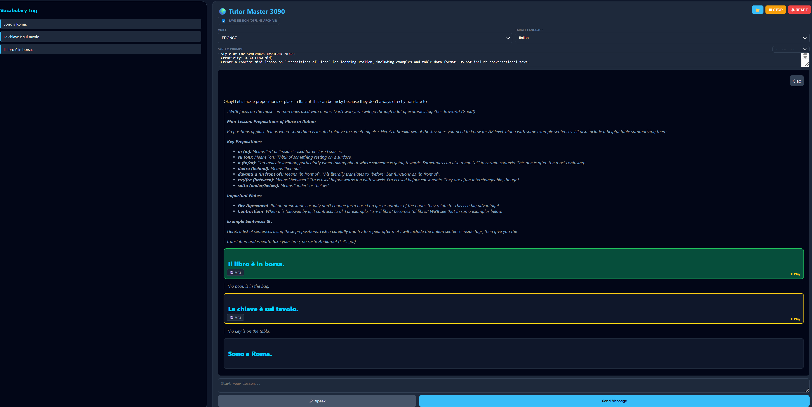

SST-LLM-TTS Local single language voice with custom voices: Local language tutor

100% local language learning application. To be used with RTX 3090 or other 24gb+VRAM(best nvidia but you can try with AMD), this app integrates Large Language Models (LLMs), Fast Whisper for "Raw" speech-to-text, and Chatterbox Multilingual TTS with custom voice caching.
🚀 Key Features

    Memory Hack (Embedding Caching): Skips the "learning" phase for voices. Once a tutor's .wav is processed, the speaker embedding is cached to disk, allowing for near-instant speech generation.

    Raw STT Mode: Configured Whisper Large-v3-Turbo with greedy decoding and disabled normalization. It captures your exact pronunciation and grammatical errors so the tutor can provide genuine corrections.

    Multi-Tiered UI: Professional dark-mode interface that color-codes Italian speech, English translations, and tutor feedback.

    Dynamic Voice Discovery: Simply drop a .wav file into the /tutors folder to add a new tutor personality instantly.

    Manual Play & Async Loading: Audio segments process in the background and become clickable as soon as they are ready. No "rushed" or overlapping audio.

    Pydub Pacing Fix: Automatically inserts silence padding and anti-pop buffers for a smooth, natural listening experience.

🛠 Tech Stack

    Frontend: HTML5, CSS3 (Inter/Segoe UI), JavaScript (AbortController for Kill-Switch logic).

    Backend: Python 3.10+, Flask (Threaded).

    LLM: External local server (e.g., LM Studio) via OpenAI-compatible API on port 1234.

    STT: faster-whisper (large-v3-turbo).

    TTS: chatterbox Multilingual TTS.

    Audio Processing: pydub + ffmpeg.
MODELS to use: at least 8b, the bigger the better around 20gb
llama-3.1-8b-lexi-uncensored-v2 (or almost any llama 3.1 instruct) 
unsloth/gpt-oss-20b
gemma3b
like gemma-3-27b-abliterated-normpreserve

📦 Installation
1. Prerequisites

    Hardware: NVIDIA GPU with 24GB VRAM (Optimized for RTX 3090).

    Software: Python 3.10, FFmpeg (added to System PATH).

2. Setup Environment
Bash

# Clone the repository
git clone https://github.com/your-username/tutor-pro-3090.git
cd tutor-pro-3090

# Create virtual environment
python -m venv venv
source venv/bin/activate  # Windows: venv\Scripts\activate

# Install dependencies
pip install flask torch faster-whisper chatterbox-tts pydub soundfile requests qrcode

3. Folder Structure

Ensure your root directory looks like this:
Plaintext

.
├── audio/               # Generated TTS files (auto-managed)
├── tutors/              # Place tutor_name.wav files here
├── voice_cache/         # Cached .pt embeddings (auto-generated)
├── server.py            # Main Flask backend
└── index.html           # Professional UI

🚦 How to Use

    Start your LLM: Launch LM Studio and start the Local Server on port 1234.

    Run the Backend:
    Bash
    (.\venv\Scripts\activate)
    python server.py

    Open the App: Navigate to http://127.0.0.1:5000/ in your browser.

    Tutor Customization: Select your tutor voice from the dropdown. Modify the System Prompt in the UI to change the tutor's strictness or teaching style.

    Practice: * Hold the 🎤 Mic button to speak.

        Wait for the Italian blocks to turn Yellow (Ready).

        Click the Italian blocks to hear the tutor speak.

⚙️ Advanced Configuration (Voice Tuning)

If a voice sounds too high-pitched or "metallic," you can adjust the individual tuning in server.py:
Python

tuning = {
    "anna": {"exag": 0.4, "cfg": 0.22},  # Lowered for deeper pitch
    "sofia": {"exag": 0.7, "cfg": 0.3}   # Standard expressiveness
}

🛡 Performance & Stability

    GPU Lock: The backend uses a threading.Lock() to prevent concurrent VRAM access, ensuring no "Tensor Size Mismatch" errors occur during multi-sentence generation.

    Abort Signal: The Reset button triggers an AbortController that instantly halts all pending network requests to LM Studio and the TTS engine.